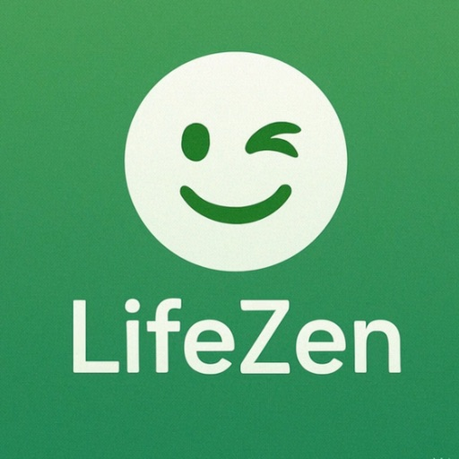

# LifeZen

LifeZen makes waste sorting in Germany easier.

Take a photo of an item and get a clear recommendation for the right bin category in seconds. LifeZen is built for everyday decisions: packaging, mixed materials, household items, and the small questions that make recycling confusing.

App Store: https://apps.apple.com/de/app/lifezen/id6760695188

OpenZen: https://openzen.info

## Why LifeZen exists

Waste sorting rules can be confusing, especially when materials are mixed, labels are unclear, or local rules differ from city to city.

LifeZen is designed to reduce that friction:

- open the camera;
- photograph the item;
- see a clear recommendation;
- understand the likely bin category;
- check local rules when the answer depends on your municipality.

The goal is not to lecture people about sustainability. The goal is to make the right action easier in daily life.

## App Store facts

- App: LifeZen
- Developer: Artem Stukalo
- Bundle ID: `com.lifezen.app`
- Version: `1.0`
- Price: free
- Category: Utilities / Lifestyle
- Minimum iOS: iOS 17.0
- Content rating: 4+
- App Store rating at time of writing: 5.0 from 3 ratings
- App Store URL: https://apps.apple.com/de/app/lifezen/id6760695188

## Funktionen

LifeZen macht Mülltrennung in Deutschland einfach.

Fotografiere einen Gegenstand und erhalte in wenigen Sekunden eine klare Empfehlung, in welche Tonne er gehört. So trennst du Abfälle schneller und sicherer im Alltag.

Funktionen:

- Fotoanalyse direkt in der App
- klare Ergebnisanzeige mit passender Tonnenkategorie
- schneller Ablauf: Kamera öffnen, fotografieren, Ergebnis sehen
- barrierearme Darstellung mit deutlichen Symbolen und Feedback

Datenschutz:

- keine Werbung
- kein Tracking
- Fotos werden nicht dauerhaft auf dem Gerät gespeichert
- Standort ist optional

Hinweis: LifeZen unterstützt bei der richtigen Trennung, ersetzt aber keine offiziellen Vorgaben. Maßgeblich sind immer die aktuellen Regeln deiner Kommune bzw. deines Entsorgers.

## Privacy-first approach

LifeZen is part of the OpenZen ecosystem, where practical AI should stay understandable, focused, and respectful of user data.

The product direction is based on:

- no advertising;
- no tracking;
- no unnecessary user profiles;
- clear output instead of fake certainty;
- optional location only when local rules matter;
- human-readable explanations for AI suggestions.

## Support and feedback

This repository is the public support and feedback space for LifeZen.

Open an issue here:

https://github.com/Arentai86/lifezen-support/issues

Helpful reports include:

- the item or material you asked about;
- the answer you expected;
- what LifeZen answered instead;
- your country, city, or municipality if local rules matter;
- screenshots if relevant.

Please do not post private documents, exact home addresses, personal IDs, payment data, private API keys, or sensitive information in public issues.

## Improvement ideas

LifeZen can grow through small, practical improvements:

- better German municipality-specific guidance;
- clearer explanations for mixed materials;
- offline fallback categories;
- more accessible result screens;
- more languages for people new to Germany;
- community feedback for edge cases;
- clearer uncertainty labels when rules differ locally.

## Part of OpenZen

OpenZen builds practical AI products and privacy-first digital tools for real-world tasks.

Current OpenZen products include:

- HelpZen — help navigation for people in Germany.
- MedZen — doctor-search assistance for Germany, not diagnosis or medical advice.
- LifeZen — waste-sorting guidance for everyday disposal decisions.
- OpenZen Studio — AI-assisted CAD and product workflow tools.
- OpenZen Remote — safer mobile control for AI agents with authentication, logs, and capability approvals.

Learn more: https://openzen.info

## Contributing

This repository is primarily for public support, feedback, product notes, and improvement ideas.

If you want to help improve LifeZen, the most useful contributions are:

- precise waste-sorting examples;
- municipality-specific rule corrections;
- accessibility feedback;
- translation suggestions;
- screenshots of confusing flows;
- issue reports with clear expected behavior.

## License and status

This is a public support repository for the LifeZen App Store product. It is not a full source-code mirror at this stage.

Product and repository maintained by OpenZen / Artem Stukalo.
